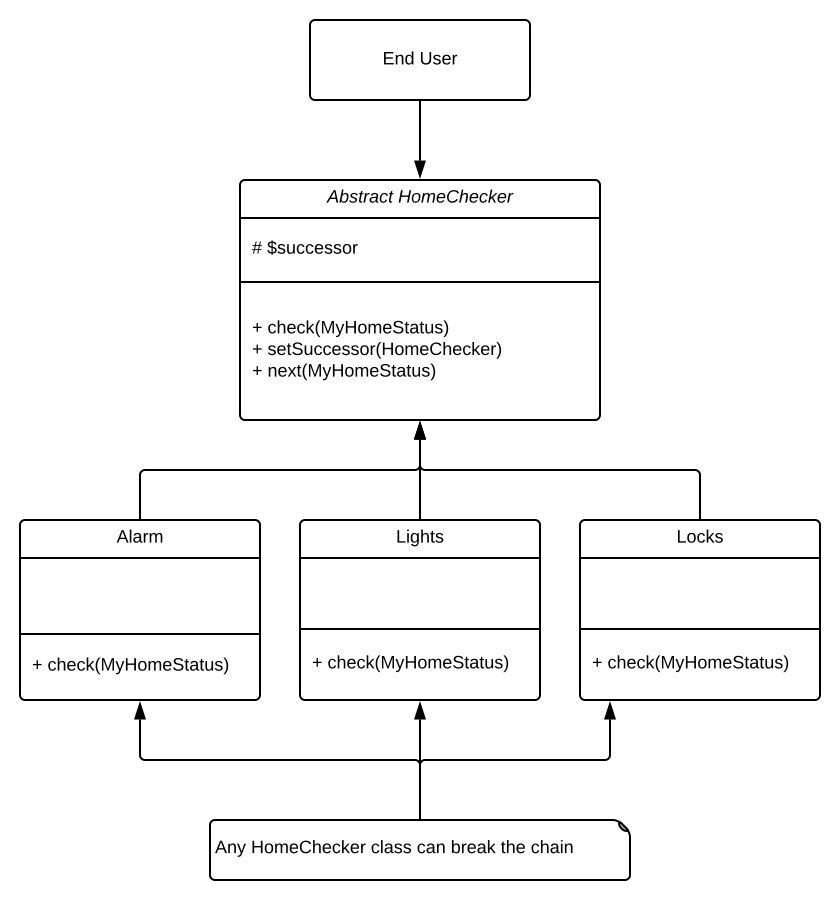

# Chain Of Responsibility

This pattern sends data through objects and if an object can use the data then it breaks the chain and returns/stops the 
process; otherwise it continues to send the data down the chain until the end.
 

**Note:** Do not use Chain of Responsibility when each request is only handled by one handler, or, when the client 
object knows which service object should handle the request.