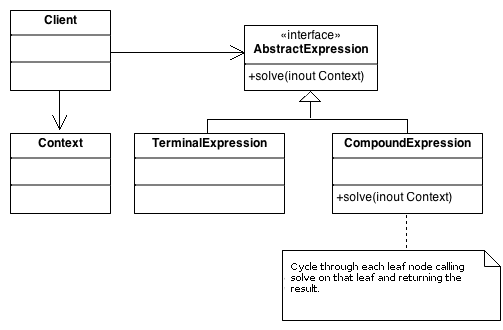

# Interpreter

The Interpreter Pattern solves grammar language by parsing through a tree-like structure like the Composite pattern. 
The composite part of the pattern is refereed to as:

### Terminal Expression.
A leaf node in the structure

### Compound Expression.
A subtree "composite" in the structure.


The interpreter pattern is general good when:

- Time and efficiency is not a concern.

- The code to be interpreted is not complex.

- The context does not need parsing. When the language is very complex, other processes (such as a parser) might be 
more appropriate.
 
 
The interpreter needs at least one class for every rule in the grammar. The `CompondExpression` holds all the other 
`expressions` and each hold, by contract, a `solve` method. In this example the `CompoundExpression::solve` method will 
search for the class `Expression`, based off the input provided, and call that `Expression::solve` to return the final 
result. 

A simple overview of the example process:

- Create a `ConversionContext` class based on the user's input. (`Context`)

- Create a `Measurements` class. (`CompoundExpression`)

- Create a `Measurement` class e.g: `Miles` class. (`Expression`)

- Create a `Measurement` class e.g: `Kilometers` class. (`Expression`)

- Add (`Miles` and `Kilometers`) to the `Measurements::add` class.

- Create Interpreter class and pass in `Measurements` class.

- Pass into `Interpreter::interpret` class the `ConversionContext` class.

- The `Interpreter::interpret` does the conversion and calling `solve` on the `Measurements::solve`, which will call 
`solve` on any object it finds and return the value.

```
$conversionContext = new ConversionContext('1 mile to kilometers');
$miles = new Miles;
$kilometers = new Kilometers;
$meters = new Meters;

$measurements = (new Measurements)->add($miles)->add($kilometers)->add($meters);

$interpreter = new Interpreter($measurements);
```




