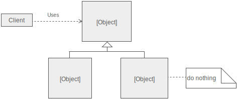

# Null Object

The null object pattern allows us to us an abstraction that does nothing. This can sometimes be beneficial as we can  
inject a null object into a method; otherwise we'll need to do null checking on the method itself.

