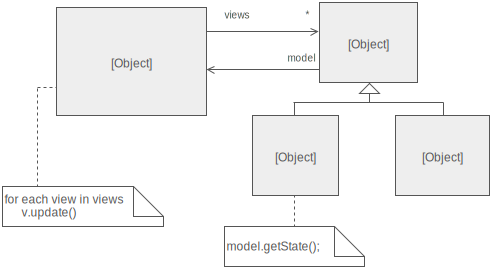

# Observer

The observer pattern defines a one to many dependency between one object to others. 

In this example we define the `Login` class as the `subject` and the `LogData` + `SendEmail` as the observers. Our trait 
`SubjectTrait` is used on the `Login` class, but it can be used on any class that you want to attach observers.

**Note:** Observers can contact the subject if they so wish after they have been notified.

