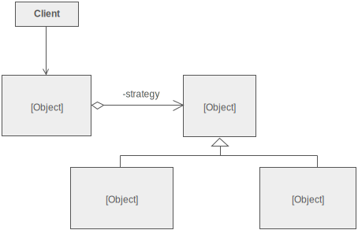

# Strategy Pattern

In the Strategy Pattern we use an interface to keep consistency between related classes so that we can swap out their 
implementations. Program to an interface, not an implementation.

In the example we have loggers which are bound by an interface and an application that accepts an object based on it's 
interface and not on it's class name. This allows us to switch out loggers without having to change the method 
signature.

