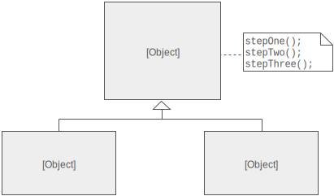

# Template

This pattern is extracting common functionality into an abstract class and what methods need to be defined in your 
subclasses and this also helps keep your subclasses DRY.

**Note:** No example files are provided as this pattern is very simple.

