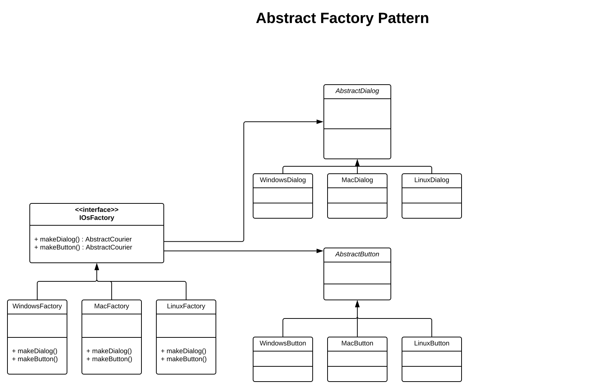

# Abstract Factory

The abstract factory pattern is very similar to the factory method pattern. In the factory method pattern you have one 
method, normally called `make`, which returns a new instance of the object you are requesting. In contrast, the abstract 
factory pattern has more than one `make` method and returns objects based on it's method call. You do not pass in the 
requested object via the `make` method you simply call the thing you need e.g. `makeDialog` and `makeWindow`.

You have different factories based on their type as an example we have three factories:

```
WindowsFactory
MacFactory
LinuxFactory
```

each extends an abstraction interface that define in this case the methods:

```
makeDialog()
makeButton()

```

If you use the `WindowsFactory` you'll get the windows UI back. If you use the `MacFactory` you'll get the mac UI back 
as an example:

```
$dialog = MacFactory::makeDialog();
$button = MacFactory::makeButton();
```

An abstract factory method is a factory that has multiple factory methods to return multiple objects.

**Note:** The classes that get returned are normally extend by an abstract class as they normally share behaviour 
between each other. For example: `WindowsDialog`, `MacDialog`, and `LinuxDialog` just look different but they all popup 
and display data. The abstract name comes from this fact.

