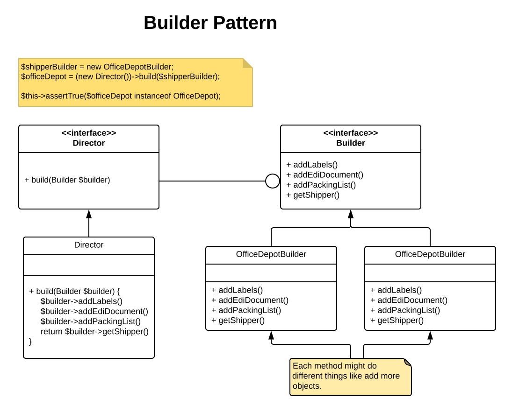

# Builder

The builder pattern is used when you want to build an object made up from other objects, and you want the creation of 
these parts to be independent of the main class.
 
The `Builder` knows each class but nobody else does, not even the `Director` class, this hides the creation of the 
different classes from the client making it loosely coupled.

As an example:

Each Builder attaches it's main class, in our example a `Shipper` class, which has common methods from an interface, 
methods like `addShippingLabels()`, `addEdiDocuments`. The `Builder` class is then injected into a `Director` class that 
calls these methods and once complete returns the object from the builder via a `getShipper` method.

Using this process each `Builder` can perform any action on those methoids e.g. adding more or different objects:

**OfficeDepotBuilder**
```
public function addEdiDocuments()
{
    $this->officeDepot->setEdiDocuments(new Edi997);
    $this->officeDepot->setEdiDocuments(new Edi856);
}
```

**StaplesBuilder**
```
public function addEdiDocuments()
{
    $this->officeDepot->setEdiDocuments(new Edi997);
    $this->officeDepot->setEdiDocuments(new Edi810);
}
```

So when the `Director` class method `build` is called it creates an object:

**Director**
```
public function build(Builder $builder)
{
    $builder->addEdiDocuments();
    $builder->addLabels();
    $builder->addPackingList();

    return $builder->getShipper();
}
```

For the client this pattern looks like the following:

```
$shipperBuilder = new OfficeDepotBuilder;
$officeDepot = (new Director())->build($shipperBuilder);
$this->assertTrue($officeDepot instanceof OfficeDepot);
```


 

 
