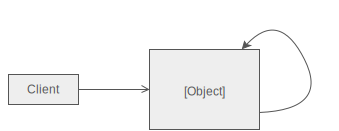

# Singleton

The singleton pattern ensures a class has only one instance. This has been used in things that are normally resource 
heavy like database connections where you only need one connection.
 
It's important to note that it is normally a good idea to use Dependency Injection rather than a singleton so that it is 
available throughout your application and can be swapped out easily.

With the singleton pattern you declare your constructor `private` and provide a `public` method like `getInstance()` 
that will first check a global variable to see if the object has already been instantiated. If it has been instantiated 
then it will just return the reference to the class, and if it has not then it will create the class and save the 
reference to the global variable and return that reference.

