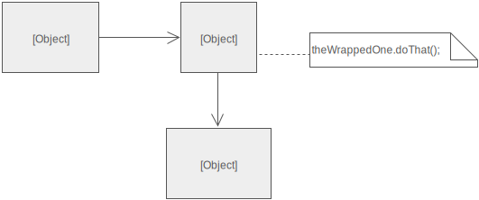

# Adapter

The adapter pattern provides an "adapter" to another implementation. So the client code can stay relatively the same.
 
In this example we have a Person class that opens a `DocumentInterface`, like a book, and performs actions on them e.g. 
`openBook` and `turnPage`.

But, if we have a class like an eReader that has different actions `turnOn` and `pressNextButton`, but we want to 
continue to use the `Person` class we can create an intermediary class `eReaderAdapter` that extends the 
DocumentInterface which can control the eReader. We can then pass it to the `Person` class to interact with it.

In summary, the `eReaderAdapter` implements `DocumentInterface` and the methods within the interface provides the 
adapter to the `Kindle` class. 

This is also useful for abstracting legacy parts of applications.

