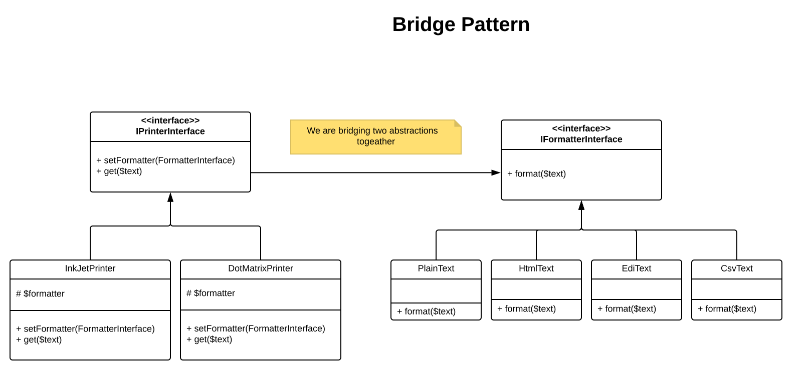

# Bridge

The bridge pattern allows you to progressively add functionality while separating out major differences using an 
abstraction.

In our example we have a `DotMatrixPrinter` and `InkJetPrinter` classes that bridges, has references, over to the 
`FormatterInterface`. So that the classes can use the functionality from that class. Otherwise, you would have to 
implement classes like:

- `DotMatrixPrinterHtmlFormat`
- `DotMatrixPrinterPlainFormat`
- `DotMatrixPrinterCsvFormat`
- `DotMatrixPrinterEdiFormat`
- `InkJetPrinterHtmlFormat`
- `InkJetPrinterPlainFormat`
- `InkJetPrinterCsvFormat`
- `InkJetPrinterEdiFormat`

Using the Bridge pattern we can just have two classes `DotMatrixPrinter` and `InkJetPrinter` and 4 Format classes e.g.

- `DotMatrixPrinter`
- `InkJetPrinter`

- `HtmlFormat`
- `PlainFormat`
- `CsvFormat`
- `EdiFormat`

