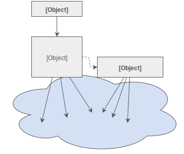

# Facade

The facade pattern provides an interface to a set of other objects. It provides a "facade" to them. A higher level 
interface to use these objects.

If you have lots of objects that interact with each other you can provide this interaction with a facade so the client 
does not need to know all about those objects.

There is no code to this pattern as it is very simple. But, as an example

- Interface DiskDriverFacadeInterface
- DiskDriverFacade
- A lot of classes that interact with the disk 

