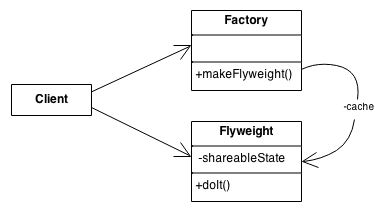

# Flyweight

The Flyweight pattern allows the reuse of objects, of similar type, cutting the performance cost of creating new 
objects. The flyweight pattern shares as much as possible, intrinsic state, with the other objects.

The flyweight object is divided into two parts: 

### Intrinsic state

This is the part of the pattern that sees a speed improvement. In our example of using the `Drawer` objects we are going 
to reuse any object that has the same color that has been used before thus reducing the number of objects that need to 
be created new.

### Extrinsic state

This is the unique part of the object that has to be defined by the client. In our case we are setting the position and 
dimensions of where we want to draw. 

The flyweight pattern uses the factory pattern to control the **Intrinsic state** only creating new objects when 
required or returning existing objects that have already been created.

**Note:** In the UML diagram the Flyweight object can either be returned from cache or if not already created made a new.

