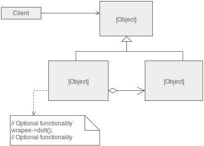

# Proxy

Provides a placeholder for an another object in order to control access.

The proxy pattern has 3 styles:

- Remote Proxy = controls access to a remote resource.
- Protection Proxy = controls resource based on access rights.
- Virtual Proxy = controls access to resource that is expensive to create

They both keep the same interface. 

This pattern is kinda similar to the Adapter pattern, but the Adapter pattern provides a different interface to its 
subject. Proxy provides the same interface.

In this example we use a `BookParserProxy` to interface to `BookParser`. The `BookParser` class does a lot of work when 
counting the number of words in the constructor. The `BookParserProxy` only calls the `BookParser` when the 
`getTotalWorlds` method is called, thus the other methods, that do not require much processing power, and be used 
without incurring the cost of counting the words each time the class is called.

The example is a little strange but for this purposes it does the job of explaining how the proxy pattern works.

